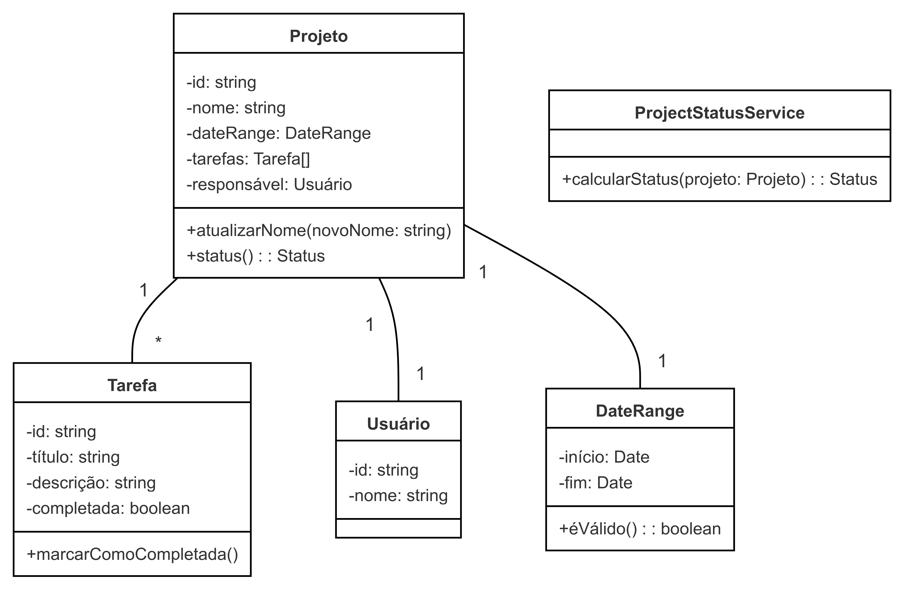

# Arquitetura de Software com TDD e DDD - WeekIT 2024

Este mini-curso foca na aplicação prática dos princípios de Desenvolvimento Orientado por Testes (TDD) e Design Orientado por Domínio (DDD) na construção de um sistema simples de gerenciamento de projetos.

## Índice

1. [Introdução](#introdução)
2. [Conceitos de DDD](#conceitos-de-ddd)
3. [Noções Básicas de TDD](#noções-básicas-de-tdd)
4. [Visão Geral do Projeto](#visão-geral-do-projeto)
5. [Modelo de Domínio](#modelo-de-domínio)
6. [Aplicando Conceitos de DDD](#aplicando-conceitos-de-ddd)
7. [Configuração do Projeto](#configuração-do-projeto)
8. [Executando Testes](#executando-testes)
9. [Diagrama de Classes](#diagrama-de-classes)
10. [Fluxo de Trabalho de Desenvolvimento](#fluxo-de-trabalho-de-desenvolvimento)

## Introdução

Este curso tem como objetivo proporcionar uma experiência prática na aplicação dos princípios de TDD e DDD para criar uma arquitetura de software robusta e sustentável. Vamos focar na construção da camada de domínio de um sistema de gerenciamento de projetos, demonstrando como essas metodologias podem levar a um código mais limpo e organizado que reflete de perto os requisitos de negócios.

## Conceitos de DDD

- Entidades
- Objetos de Valor
- Agregados
- Serviços de Domínio
- Repositórios

## Noções Básicas de TDD

- Ciclo Red-Green-Refactor
- Escrevendo testes significativos
- Isolamento de testes

## Visão Geral do Projeto

Estamos construindo um sistema simples de gerenciamento de projetos com as seguintes entidades principais:

- Projeto
- Tarefa
- Usuário

## Modelo de Domínio

Nosso foco será na implementação e teste da camada de domínio, que encapsula a lógica de negócios principal de nossa aplicação.

## Aplicando Conceitos de DDD

Além das entidades básicas, aplicaremos os seguintes conceitos de DDD:

1. **Objeto de Valor**: Criar um objeto de valor `DateRange` para representar as datas de início e fim de um projeto.

2. **Agregado**: Tratar `Projeto` como uma raiz de agregado, com `Tarefa` como parte de seu agregado.

3. **Serviço de Domínio**: Implementar um `ProjectStatusService` para calcular o status geral de um projeto com base em suas tarefas.

## Configuração do Projeto

Este projeto usa NestJS. Para configurá-lo:

1. Clone o repositório
2. Instale as dependências:
  ```
  npm install
  ```
3. Execute o servidor de desenvolvimento:
  ```
  npm run start:dev
  ```

## Executando Testes

Execute a suíte de testes usando Jest:

```
npm run test
```

## Diagrama de Classes



